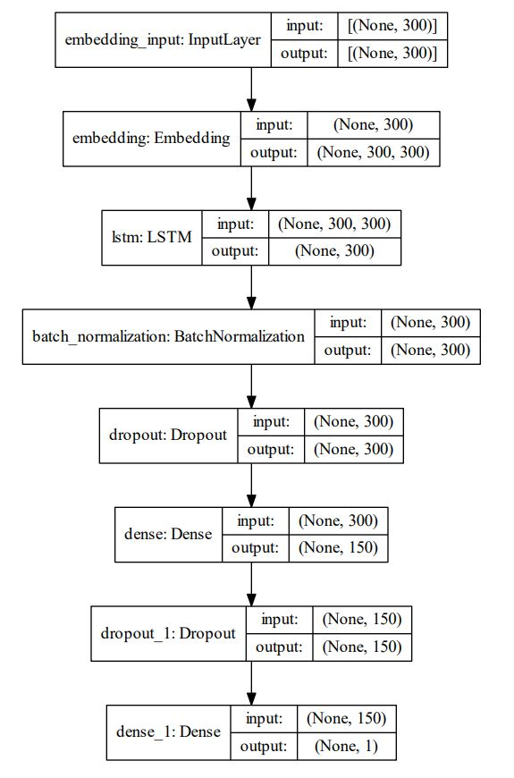
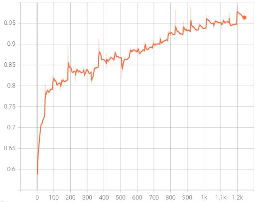
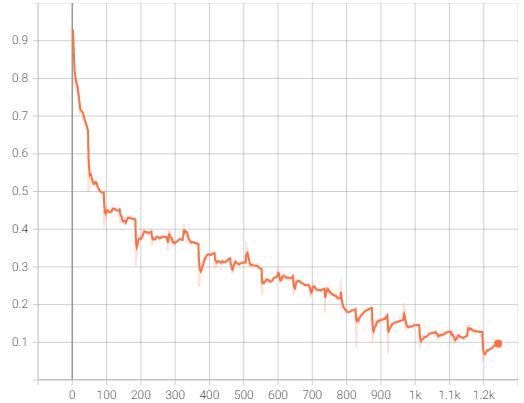

# Text Classification with RNN using Tensorflow and Keras
___
Building End-to-End deep learning model for any text classification problem using pre-trained GloVe embeddings and recurrent layers


## List of Software environments:
---
* [Tensorflow](https://www.tensorflow.org/install): Version 2.4
* [Python](https://www.python.org/downloads/release/python-3711/): Version 3.7.11
* scikit-learn: Version 0.24.2
* numpy: Version 1.19.5
* pandas: Version 1.3.1

## Default Model architecture
---
<br />



<br />

## Default Model parameters
---
Sample data used to train model with default parameters can be downloaded from [link](https://www.kaggle.com/c/nlp-getting-started/data?select=test.csv)
* Train File name: train.csv
* Test File name: test.csv
* Paddding size: 300
* Embedding dimensition: 300
* Dropout rate (only to dense layer, recurrent layer is 0.2 by default): 0.5
* Batch size: 64
* Epochs: 500
* Patience (early stopping): 20 epochs

## Run on Demo Data
---
These results are just capability of model, you can optimize it according to your own data by changing parameters

<br />

***Accuracy***



<br />

***loss***



## Usage
---

```
usage: train.py [-h] [-f FILE_NAME] [-tc TEXT_COLUMN] [-lc LABEL_COLUMN]
                [-n MAX_NB_WORDS] [-s MAX_SEQ_LEN] [-t TEST_SIZE] [-u UNITS]
                [-l N_LAYERS] [-c CELL] [-b BIDIRECTIONAL] [-e EMBEDDING_SIZE]
                [-d DROPOUT] [-lo LOSS] [-o OPTIMIZER] [-cl OUTPUT_LENGTH]
                [-a ACTIVATION] [-m METRICS] [-p PATIENCE] [-bs BATCH_SIZE]
                [--epochs EPOCHS] [--results_dir RESULTS_DIR]

This is RNN classification project.

optional arguments:
  -h, --help            show this help message and exit
  -f FILE_NAME, --file_name FILE_NAME
                        This is training file name with .csv
                        extension.(default=train.csv)
  -tc TEXT_COLUMN, --text_column TEXT_COLUMN
                        Text column to train model.(default=text)
  -lc LABEL_COLUMN, --label_column LABEL_COLUMN
                        Target or label column for text data.(default=target)
  -n MAX_NB_WORDS, --max_nb_words MAX_NB_WORDS
                        Maximum vocabulary size of training data, rest will be
                        discarted.(default=20000)
  -s MAX_SEQ_LEN, --max_seq_len MAX_SEQ_LEN
                        Maximum length of words in each text.(default=300)
  -t TEST_SIZE, --test_size TEST_SIZE
                        The fraction of validation data.(default=0.25)
  -u UNITS, --units UNITS
                        Number of units for RNN cell.(default=300)
  -l N_LAYERS, --n_layers N_LAYERS
                        Number of hidden layers.(default=1)
  -c CELL, --cell CELL  Type of RNN cell.(default=LSTM)
  -b BIDIRECTIONAL, --bidirectional BIDIRECTIONAL
                        Whether RNN cell is BiDirectional.(delafult=False)
  -e EMBEDDING_SIZE, --embedding_size EMBEDDING_SIZE
                        Pre trained GloVe 6B vocabulary
                        embeddings.(default=300)
  -d DROPOUT, ---dropout DROPOUT
                        Dropout rate in sigmoid/softmax layer.(default=0.5)
  -lo LOSS, --loss LOSS
                        Loss function for RNN.(default=binary_crossentropy)
  -o OPTIMIZER, --optimizer OPTIMIZER
                        Optimizer function for RNN.(default=adam)
  -cl OUTPUT_LENGTH, --output_length OUTPUT_LENGTH
                        Number of target classes.(default=1)
  -a ACTIVATION, --activation ACTIVATION
                        Activation function for output layer.(default=sigmoid)
  -m METRICS, --metrics METRICS
                        Measure for optimization of
                        model.(default=binary_accuracy)
  -p PATIENCE, --patience PATIENCE
                        Early stopping before waiting for additional
                        epochs.(default=20)
  -bs BATCH_SIZE, --batch_size BATCH_SIZE
                        Mini-Batch size.(default=64)
  --epochs EPOCHS       Number of epochs.(default=500)
  --results_dir RESULTS_DIR
                        The results folder includes log, model, vocabulary and
                        some images.(default=./Results/)
```

<br />

```
usage: test.py [-h] [-f FILE_NAME] [-tc TEXT_COLUMN]
               [--results_dir RESULTS_DIR] [-bs BATCH_SIZE] [-s MAX_SEQ_LEN]
               [-m MULTIPLE]

This is the Bi-LSTM test project.

optional arguments:
  -h, --help            show this help message and exit
  -f FILE_NAME, --file_name FILE_NAME
                        This is test file name with .csv
                        extension.(default=test.csv)
  -tc TEXT_COLUMN, --text_column TEXT_COLUMN
                        Text column to test model.(default=text)
  --results_dir RESULTS_DIR
                        The results dir including log, model, vocabulary and
                        some images.
  -bs BATCH_SIZE, --batch_size BATCH_SIZE
                        Mini-Batch size.(default=64)
  -s MAX_SEQ_LEN, --max_seq_len MAX_SEQ_LEN
                        Maximum length of words in each text.(default=300)
  -m MULTIPLE, --multiple MULTIPLE
                        Whether multi-classification or not.(default=False)
```

<br />

## Need to know
---
1. You need to alter `load.py` script to match your data file
2. This code uses [GloVe](https://nlp.stanford.edu/data/glove.6B.zip) embedding of 6B words only, you can select 50, 100, 200 or 300 dimension. Download from link and unpack to Data Folder
4. Abbreviations and most frequently misspelled words are corrected using GloVe coverage OOV. You can adapt to your data using `abbreviations.py` script
5. The model will be saved by `hdf5` files
6. Tensorboard is available
7. ***Code is running using NVIDIA GeForce GTX 1650 GPU***


